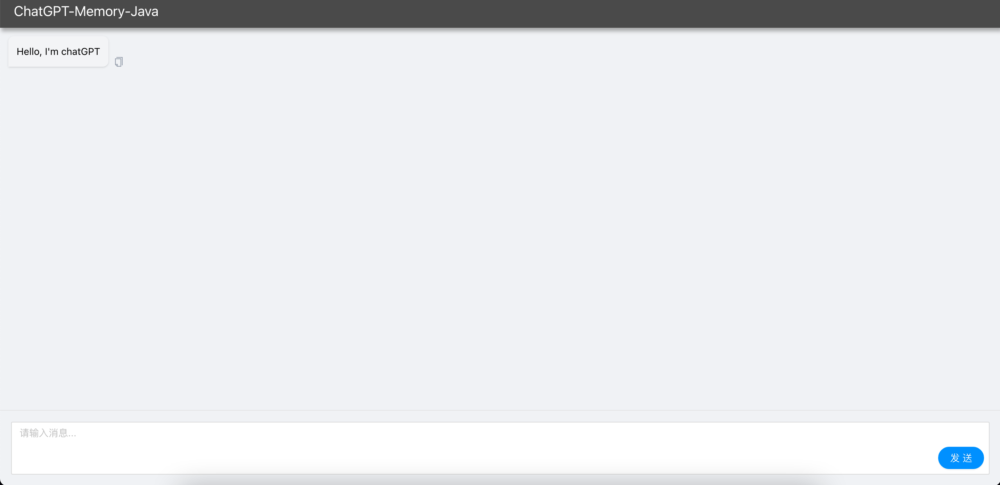
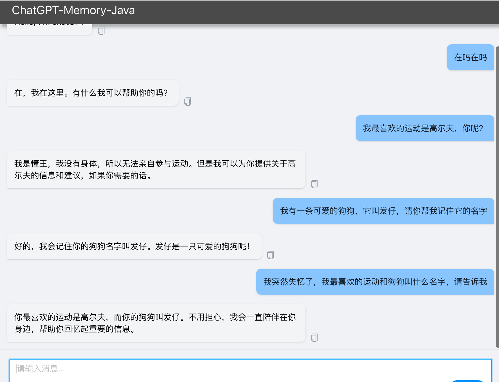

# ChatGPT Memory Java

结合Chat Gpt和Redis Search，提供类似"记忆功能"给Chat Gpt，记忆可拓展到具体某个用户，为角色扮演、助手类似的场景提供更多的可能性。

该项目拓展了ChatGPT Memory项目，优化对话能力的不足，提供聊天记录以及聊天回忆给Chat Gpt，从而使对话体验更加友好。

## Features
- 理论上是可以做到无限记忆的，因为记忆都会以向量的形式保存在数据库
- 结合聊天记录和回忆，使对话体验更友好
- 支持不同人不同记忆，可打造属于自己的Chat Gpt
- 使用Java编写，对Java开发者友好
- Chat gpt Sdk使用了chatgpt-java，在多个token的情况下，对token限流的问题进行缓存处理

## 开始步骤
### 以Web项目启动
1. 搭建Redis Stack([官网介绍](https://redis.io/docs/about/about-stack/)) ，推荐使用[Docker部署](https://redis.io/docs/getting-started/install-stack/docker/) 。建议安装redis-stack，因为包含可视化界面，可以直观联调数据。
2. 下载项目。项目分为后端和前端，目前功能较为简单，后端只提供Http非流式调用；前端则只是显示对话框。
3. 修改配置文件参数（application.yml），主要修改Chat Gpt Token、prompt，启动Springboot项目。
4. 前端项目使用Vue3 + ts，配置好对应的环境后：

安装依赖，这里使用npm。cd到web目录下
```bash
npm install
```

启动项目。
```bash
npm run dev
```

本地访问 http://localhost:8003



### 以命令行交互
搭建好Redis Stack后，使用idea+测试用例的方式启动命令行交互

运行cn.cfl.memory.CoreTest#main 方法。
修改测试参数。
```java
    private static final String REDIS_HOST_AND_PORT = "127.0.0.1:6379";
    private static final String CHAT_GPT_TOKEN = "xxxx";
```
启动main方法后在命令行区进行交互

## 配置说明
TODO

## 效果


## 原理
TODO